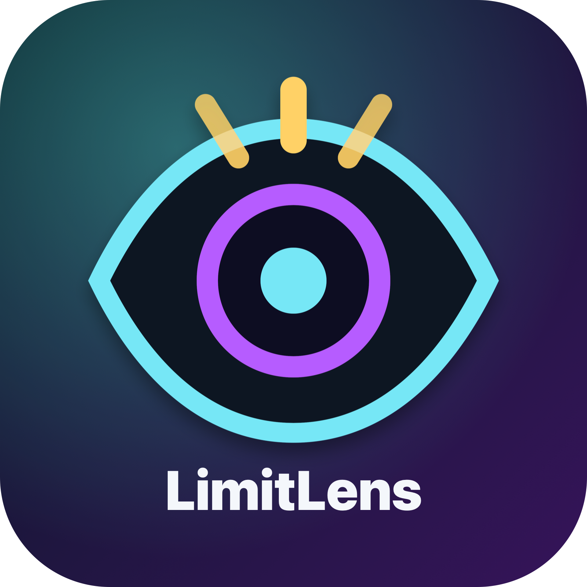

<div align="center">
  
  <h1>LimitLens 💡</h1>
  <p><strong>The ultimate unified quota monitor for AI coding tools.</strong></p>

  [](https://github.com/salauddinn/limitlens/actions/workflows/ci.yml)
  [](https://opensource.org/licenses/MIT)
  [](https://www.python.org/downloads/)
  [](https://buymeacoffee.com/salauddin.n)
</div>

If you juggle multiple AI subscriptions, tools, and accounts, and frequently run into rate limits, **LimitLens** gives you a **lightweight, local CLI tool**—along with an iTerm2 widget—to monitor all of your available quotas in one unified dashboard.

<p align="center">
  
  &nbsp;&nbsp;&nbsp;
  
</p>

---

## Start here

1. Install LimitLens.
2. Run `limitlens doctor` to check which providers are ready.
3. Run `limitlens` to see all quotas.
4. Run `limitlens suggest` to pick the best tool for your next task.
5. Optional: enable the iTerm2 widget.

---

## ✨ Features

- **📊 Unified Dashboard:** Instantly view remaining headroom, reset times, and limits across all your installed accounts and profiles.
- **🧠 Smart Recommendations:** Automatically suggests the best tool for the job based on remaining quotas to prevent wasting premium fast requests.
- **⚡ Lightweight CLI:** Written in Python with minimal runtime dependencies and no external services required.
- **🪄 Zero-Config Auto-Detection:** Automatically scans system paths for active tools and configs on first run—no manual setup required.
- **📟 iTerm2 Widget:** Native background script that powers a live, real-time widget directly in your terminal's status bar.
- **⏱️ Time-To-Exhaustion (TTX):** Analyzes your consumption rate to project exactly when you will run out of quota.
- **🔒 Privacy First:** Credentials (API keys, OAuth tokens, session cookies) are read from local stores and sent only to the respective provider's own API to fetch quota data — never to third parties. LimitLens does not copy provider credentials into its config files, and logs redact common credential formats. Local outputs automatically redact sensitive paths and emails.
- **🔑 Secure Keychain:** Use native OS keychains to store API tokens securely instead of plaintext files.

---

## 🚀 Installation

### Quick Install (macOS & Linux)
One command to install everything — automatically detects your OS, installs `pipx` if needed, and installs the iTerm2 widget:

```sh
curl -fsSL https://raw.githubusercontent.com/salauddinn/limitlens/main/install.sh -o install.sh
# Inspect the script before running: cat install.sh
bash install.sh
```

### Manual Install (pipx)
Modern systems (like macOS with Homebrew or recent Linux distributions) block global `pip` installs to protect system stability (PEP-668). The best way to install LimitLens globally is using `pipx`.

1. Install `pipx` if you haven't already (e.g., `brew install pipx` or `apt install pipx`).
2. Install LimitLens globally from PyPI:
   ```sh
   pipx install limitlens
   ```

### Dev / Nightly Install (from `main`)
To track the latest unreleased work on the `main` branch, install directly from GitHub instead of PyPI:

```sh
pipx install "git+https://github.com/salauddinn/limitlens.git"
```

### Uninstall
To completely remove LimitLens and optionally your config:

```sh
curl -fsSL https://raw.githubusercontent.com/salauddinn/limitlens/main/uninstall.sh -o uninstall.sh
bash uninstall.sh
```


---

## 📚 Operations & Runbook

For deployment readiness, troubleshooting, and production guidelines, please refer to the [Operations Runbook](docs/OPERATIONS_RUNBOOK.md).

---

## 🔌 Supported Integrations

LimitLens natively parses configs, SQLite databases, and APIs for leading tools.

| Provider | Supported OS | Notes / Details |
|:---|:---|:---|
| **Codex** | macOS, Linux | Parses local configurations from `~/.codex-*` |
| **Amp** | macOS, Linux | Executes local `amp` binary to fetch quota and observed dollar usage |
| **Antigravity** | macOS, Linux | Limited to Darwin/Linux configurations |
| **Cursor** | macOS, Linux, Win | Fetches active limits across Cursor tiers |
| **Cline CLI** | macOS, Linux, Win | Reads local `cline` CLI readiness/version and fetches ClinePass quota windows (5h, weekly, monthly) via the stored OAuth token |
| **OpenCode** | macOS, Linux, Win | Reads directly from the local OpenCode SQLite database |
| **Pi** | macOS, Linux, Win | Reads local `~/.pi/agent/sessions` JSONL usage data |
| **Kilo Code** | Any OS | Reads local Kilo SQLite usage from `~/.local/share/kilo/kilo.db` by default; runner launches `kilo run` |
| **Claude Code** | macOS, Linux, Win | Reads local Claude project/session usage from `~/.claude/projects` |
| **Copilot CLI** | macOS, Linux, Win | Reads observed CLI usage from the configured OTel JSONL cache |
| **Pioneer** | Any OS | Reads `PIONEER_API_TOKEN` environment variable and queries API |
| **Command Code**| Any OS | Web billing queried using `COMMANDCODE_COOKIE` |

---

## 💻 Usage

Monitor everything with a single command:

```sh
limitlens doctor     # Check local provider readiness and next setup steps
limitlens            # Show full status across all tracked AI tools
limitlens --tool codex  # Filter output to a specific tool
limitlens --watch    # Keep alive and refresh every 5 seconds
limitlens --reco     # Only print the smart AI tool recommendation
limitlens --waste    # Show waste report and Time-To-Exhaustion (TTX) projections
limitlens --usage    # Show usage history, including observed Amp dollar spend
limitlens --reset-spend # Reset tracking baseline for observed usage and manual custom tools
limitlens --store-token pioneer # Securely store an API token in the OS keychain (prompts securely)
limitlens --init-config # Detect installed tools and write ~/.config/limitlens/config.json
limitlens run "Fix the failing tests" # Launch the best available agent CLI
limitlens run --dry-run "Plan the migration" # Preview routing without launching an agent
limitlens-switch     # Switch context interactively and execute a tool in place
limitlens-switch -t amp "refactor code" # Immediately switch to and run amp with args
```

> **Quota-aware launcher:** `limitlens run "..."` uses fast local heuristics plus LimitLens quota data to choose and launch a CLI agent directly (for example Pi for planning/research, Antigravity CLI for coding, then Amp/Codex/OpenCode-style fallbacks). It honors provider `enabled: false`, existing ignored accounts/models, and optional `runner.ignored_tools`. Override with `limitlens run --tool agy "..."`. Configure commands under the optional `runner.tools` section in `config.json`.

Default launcher commands are intentionally simple and match current CLI help output: `pi <prompt>`, `kilo run <prompt>`, `agy --prompt-interactive <prompt>`, `amp` with the prompt on stdin, `codex <prompt>`, `opencode run <prompt>`, `cline <prompt>`, and `cmd <prompt>`. Use `limitlens run --dry-run "..."` to preview the selected command before launching.

> **Spend Resets:** Running `limitlens --reset-spend` resets the spend tracking baseline for observed usage (Pi, Kilo, OpenCode, and Copilot CLI) so that future reports only show usage accumulated from that point onward. It also rewrites and resets any local counters (like `used` and `request_count`) for `custom_tools` inside your `config.json`.

> **Tip:** Codex session data is refreshed automatically before output. You can use `--sync-codex` to forcefully refresh every discovered account, even if current data looks fresh. Use `--refresh-codex` to refresh all discovered Codex accounts and exit without printing status (handy for cron jobs and automation).

---

## 📟 iTerm2 Widget

Bring real-time quota visibility to your terminal window.

1. Open **iTerm2**.
2. Go to **Scripts > Manage > New Python Script**.
3. Choose **Basic** → **Long-Running Daemon** and name it `iterm_widget.py`.
4. Copy the contents of `iterm_widget.py` from this repository into the new file.
5. If `limitlens` is on your PATH (installed via `pipx`), the `USER_LIMITLENS_DIR` variable can be left empty — the widget auto-detects it. Otherwise set it to your clone path.
6. Enable it via **iTerm2 Preferences → Profiles → Session → Configure Status Bar**.

---

## ⚙️ Configuration & Privacy

**Zero-Config Auto-Detection:** When no config exists, LimitLens scans your system paths (like `~/.codex-*` or `~/.cursor`) in memory to detect installed tools without modifying files. To create a starter config explicitly, run `limitlens --init-config`.

No manual configuration is required by default, but LimitLens is highly customizable.
You can edit the config file at `~/.config/limitlens/config.json` to completely disable any supported provider by setting its `"enabled"` property to `false`:

```json
{
  "cursor": {
    "enabled": false
  },
  "display": {
    "auto_hide_enabled": true,
    "auto_hide_days": 1,
    "amp_usable_pct": 30.0
  },
  "custom_tools": {
    "enabled": true,
    "tools": {
      "kilo": {
        "name": "Kilo Code",
        "total": 84917038,
        "used": 2582962
      }
    }
  }
}
```

You can also selectively **ignore specific accounts or profiles** without disabling the whole provider.
This is useful when you have multiple Codex accounts or Antigravity profiles and only want to track certain ones.

```json
{
  "codex": {
    "enabled": true,
    "ignored_accounts": ["codex-old", "default"]
  },
  "antigravity": {
    "enabled": true,
    "ignored_accounts": ["ide", "work-profile"]
  }
}
```

> **Codex** accounts map to `~/.codex-<name>` directories. Use the account name (e.g. `work`, `default`, `codex-work`).
> **Antigravity** profiles include named IDE profiles and CLI profiles (e.g. `ide`, `agy-cli`). Matching is case-insensitive.

### Provider configuration reference

For a complete copy-pasteable schema, see [`config.example.json`](config.example.json). Common provider keys are:

| Provider | Default source / setup | Useful config keys |
|:---|:---|:---|
| Codex | Auto-discovers `~/.codex-*`; use `--sync-codex` to force refresh | `codex.enabled`, `codex.auto_refresh`, `codex.ignored_accounts` |
| Amp | Runs local `amp` command | `amp.enabled`, `amp.individual_credits` |
| Antigravity | Reads local Antigravity profiles/CLI state | `antigravity.enabled`, `antigravity.ignored_accounts` |
| Cursor | Reads local Cursor account/limit state | `cursor.enabled` |
| Cline CLI | Requires local `cline`; ClinePass quotas use Cline's stored OAuth token | `cline.enabled`; runner override under `runner.tools.cline` |
| OpenCode | Reads SQLite DB at `~/.local/share/opencode/opencode.db` | `opencode.db_path`, `opencode.days`, `opencode.providers`, `opencode.ignored_models`, `opencode.model_parents`, `opencode.credit_limits` |
| Pi | Reads JSONL sessions from `~/.pi/agent/sessions` | `pi.sessions_dir`, `pi.days`, `pi.providers`, `pi.ignored_models`, `pi.model_parents` |
| Kilo Code | Reads SQLite DB at `~/.local/share/kilo/kilo.db`; runner uses `kilo run` | `kilo.db_path`, `kilo.days`, `kilo.providers`, `kilo.ignored_models`, `kilo.model_parents`; `runner.tools.kilo.command` |
| Claude Code | Reads project/session usage from `~/.claude/projects` | `claude.sessions_dir`, `claude.days`, `claude.providers`, `claude.ignored_models`, `claude.model_parents` |
| Copilot CLI | Reads configured OTel JSONL cache | `copilot_cli.otel_jsonl_path`, `copilot_cli.days` |
| Pioneer | Set `PIONEER_API_TOKEN` or run `limitlens --store-token pioneer`; configure team metadata when needed | `pioneer.enabled`, `pioneer.team_id`, `pioneer.team_name` |
| Command Code | Set `COMMANDCODE_COOKIE`; configure billing URL/total if needed | `commandcode.enabled`, `commandcode.credits_url`, `commandcode.total` |
| Custom tools | Manual quotas for anything not natively supported | `custom_tools.enabled`, `custom_tools.tools.<id>.total`, `remaining`, `used`, `request_count` |
| Runner | Optional overrides for `limitlens run` command routing | `runner.ignored_tools`, `runner.tools.<id>.command`, `runner.tools.<id>.prompt_mode` (`arg` or `stdin`) |

### 🔒 Privacy Guarantee
* `limitlens` does **not** copy provider credentials into its config files. If you explicitly use `--store-token`, the credential is stored in the operating system's keychain. Sensitive identifiers in output/logs are automatically redacted on-the-fly (e.g., email addresses are masked as `us***@domain.com`, and absolute home directory paths are replaced with `~`).
* To fetch live quota data, `limitlens` reads credentials (API keys, OAuth tokens, SSO cookies) from local stores or environment variables and transmits them **only to the respective provider's own API** (e.g., Cursor bearer token to cursor.com, Grok SSO cookie to grok.com, Pioneer API token to the Pioneer API). Credentials are never sent to third parties.
* The logging subsystem redacts cookies, bearer tokens, API keys, and similar common secret formats before records reach disk.

---

## 🤝 Contributing & Support

We welcome contributions! To test locally, use the project's virtual environment:
```sh
git clone https://github.com/salauddinn/limitlens.git
cd limitlens
python3 -m venv .venv
source .venv/bin/activate
pip install -e ".[dev]"
python -m pytest tests/
```

If **LimitLens** has saved you from rate limits, consider buying me a coffee to support continued development!

<a href="https://buymeacoffee.com/salauddin.n" target="_blank"></a>
