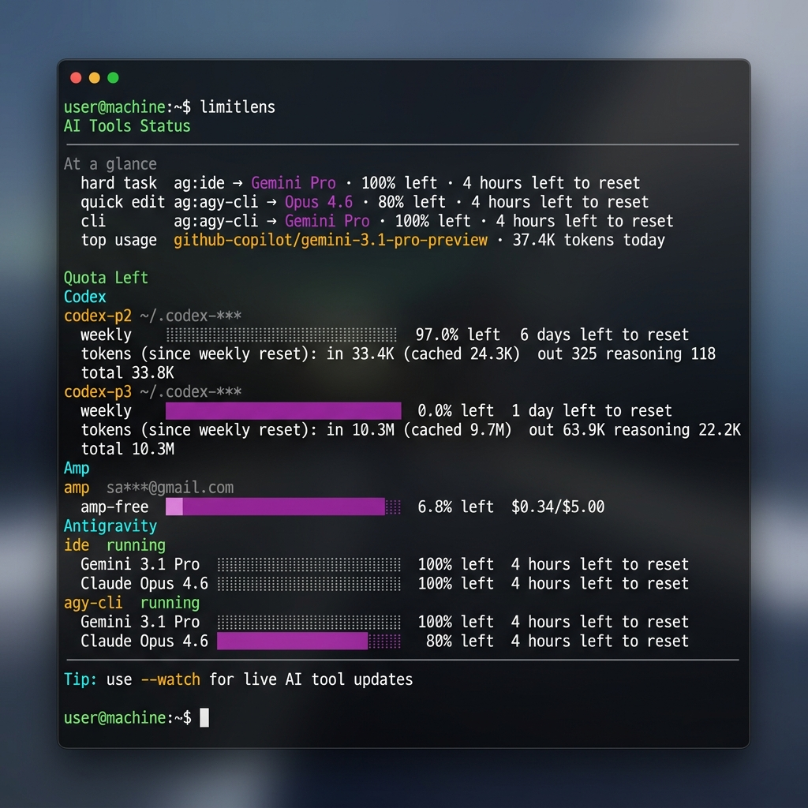
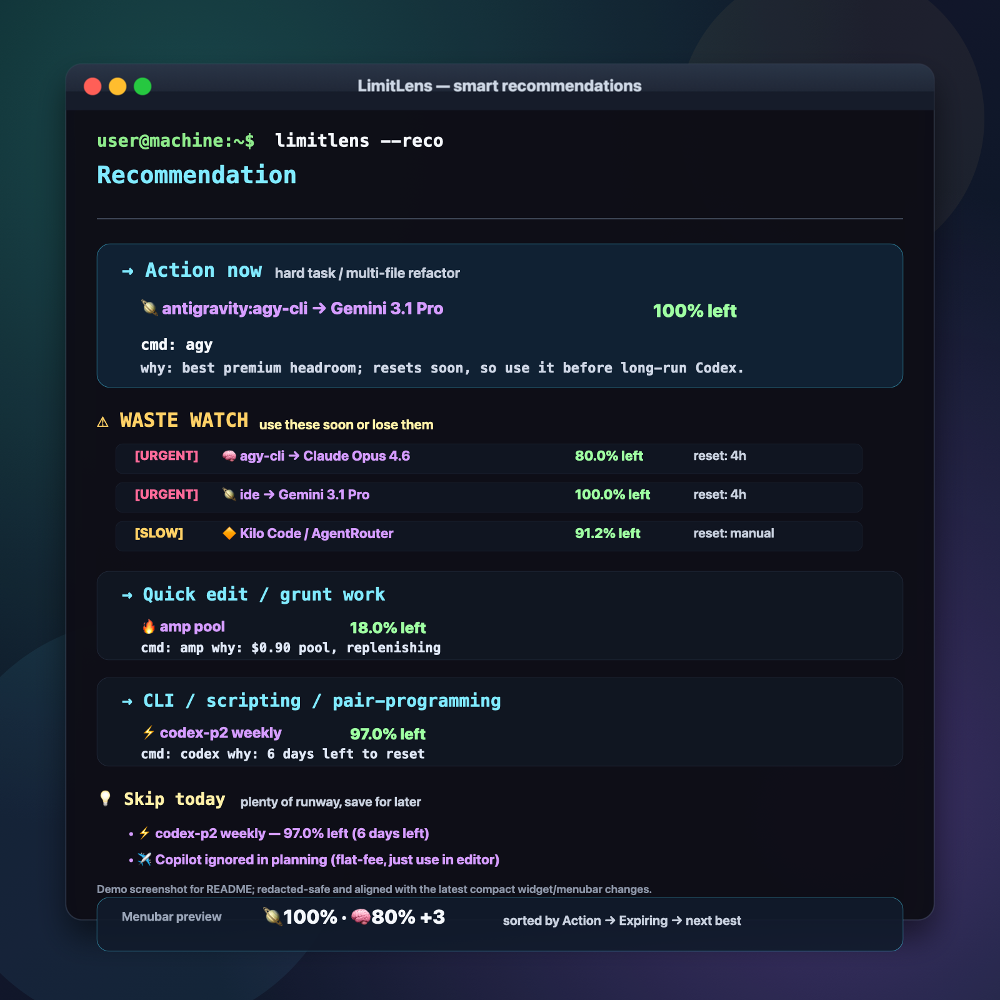

# LimitLens

[](https://github.com/salauddinn/limitlens/actions/workflows/ci.yml)
[](https://opensource.org/licenses/MIT)
[](https://www.python.org/downloads/)

[](https://buymeacoffee.com/salauddin.n)

A unified status and quota checker for popular AI coding tools: **Codex**, **Amp**, **OpenCode**, **Antigravity**, **Pioneer**, and **AgentRouter/Kilo Code**.

If you juggle multiple AI subscriptions and accounts and frequently run into rate limits, `limitlens` gives you a local, zero-dependency CLI tool (and an iTerm2 widget!) to monitor all of your available quotas in one place.

<p align="center">
  
  
</p>

## Features
- **Unified Quota Tracking:** Instantly see the remaining headroom, reset times, and limits across all your installed accounts and profiles.
- **Zero-Dependency CLI:** Written purely in standard Python with no runtime package dependencies; install with pip or run from a clone.
- **iTerm2 Widget Included:** Features a built-in background script that puts a live, real-time widget in your iTerm2 status bar.
- **Smart Recommendations:** Automatically suggests the best tool to use based on your remaining quota to avoid wasting your fast premium limits.

## Installation

### Option 1: pip install (recommended)
```sh
python -m pip install git+https://github.com/salauddinn/limitlens.git
```

This installs the `limitlens` command in your active Python environment. You can also run it as a module:
```sh
limitlens --help
python -m limitlens --help
```

### Option 2: Local development setup
```sh
git clone https://github.com/salauddinn/limitlens.git
cd limitlens
python -m pip install -e ".[dev]"
python -m pytest
```

### Option 3: Clone and alias
Clone this repository anywhere on your machine:
```sh
git clone https://github.com/salauddinn/limitlens.git
```

Then, add a permanent alias to your shell profile (e.g., `~/.zshrc`):
```sh
alias limitlens="python3 /path/to/limitlens/limitlens.py"
```

## Usage

```sh
limitlens            # full status across all tools
limitlens --tool opencode
limitlens --tool pioneer
limitlens --tool agentrouter
limitlens --verbose  # show full usage rows and low-level warnings
limitlens --help     # flags (e.g. --no-color, tool filters)
```

## iTerm2 Status Bar Widget

You can add a live-updating widget to your iTerm2 status bar that shows your available quotas!

1. Open **iTerm2**.
2. Go to **Scripts -> Manage -> New Python Script**.
3. Choose **Basic** -> **Long-Running Daemon**.
4. Name it `iterm_widget.py`.
5. Open the newly created file and copy-paste the contents of `iterm_widget.py` from this repository.
6. **Important:** Edit the `USER_LIMITLENS_DIR` variable at the top of the script to point to the absolute path where you cloned this repository.
7. Go to **iTerm2 Preferences -> Profiles -> Session -> Configure Status Bar** and drag the "LimitLens Widget" into your active components.

*(Note: If you are an advanced user, you can simply symlink `iterm_widget.py` directly into your `~/Library/Application Support/iTerm2/Scripts/AutoLaunch` folder, and the script will automatically detect its directory without any configuration needed!)*

## Configuration (Optional)

Defaults work out of the box without a config file. To customize tracking and display behavior:
1. Copy `config.example.json` to `~/.config/limitlens/config.json`, OR
2. Set the environment variable `LIMITLENS_CONFIG=/path/to/config.json`.

### Display & Privacy Settings

Add a `"display"` section to your configuration to control output behavior:
*   `auto_hide_enabled` (boolean, default: `true`): Automatically hide tools that have not been used recently to keep your terminal output clean.
*   `auto_hide_days` (integer, default: `1`): Number of days of inactivity before a tool is hidden.
*   `amp_usable_pct` (float, default: `30.0`): Percentage threshold below which Amp is flagged as low/unusable.

**Privacy & Security:**
*   `limitlens` does not store or transmit any sensitive information (such as API keys, secrets, or session cookies).
*   Any sensitive identifiers in output/logs are automatically redacted on-the-fly (e.g., email addresses are masked as `us***@domain.com`, and absolute home directory paths are replaced with `~`).

### Platform Support

The core engine and configuration are completely platform-agnostic, but individual providers have varying support depending on the underlying tool's native environment:

| Provider | Supported OS | Notes / Details |
|---|---|---|
| **Codex** | macOS, Linux | Parses local configurations from `~/.codex-*` |
| **Amp** | macOS, Linux | Executes the local `amp` binary to fetch quota |
| **Antigravity** | macOS, Linux | Limited to Darwin/Linux systems |
| **OpenCode** | macOS, Linux, Windows | Reads from the local OpenCode SQLite database |
| **Pioneer** | Any OS | Reads `PIONEER_API_TOKEN` environment variable and queries API |
| **AgentRouter/Kilo Code** | Any OS | Reads AgentRouter quota from env-authenticated API or sanitized manual config |

### Observed Usage Logging

OpenCode usage is read automatically from its local SQLite DB and grouped by provider/model.

If an OpenCode model is the same underlying quota as another tool, either exclude it from the OpenCode usage rollup with `ignored_models`, or keep it visible and label its parent quota with `model_parents`:

```json
{
  "opencode": {
    "ignored_models": [],
    "model_parents": {
      "openai/gpt-5.5": "Codex / codex-p1",
      "anthropic/claude-opus-4-8": "Pioneer",
      "google-vertex/*": "Vertex Free Trial"
    }
  }
}
```

To show manually tracked OpenCode credit balances alongside observed usage, add `credit_limits` under the `opencode` config:

```json
{
  "opencode": {
    "credit_limits": [
      { "name": "Vertex Free Trial", "total": 28442.99, "remaining": 27793.82, "unit": "₹" }
    ]
  }
}
```

You can provide `remaining`, `used`, or both. If `total` and `remaining` are set, LimitLens computes the used amount automatically.

For Copilot CLI usage, launch Copilot with:
```sh
COPILOT_OTEL_FILE_EXPORTER_PATH=~/.cache/limitlens/copilot-otel.jsonl copilot
```

For Pioneer, set `PIONEER_API_TOKEN` in your environment. If your account uses a team billing endpoint, add the team id to your config and LimitLens will call `/billing/team/{team_id}/full-status`:

```json
{
  "pioneer": {
    "enabled": true,
    "team_id": "your-team-id"
  }
}
```

The Pioneer `full-status` response reports usage in cents-like units, so LimitLens displays `credit_limit: 3000.0` as `$30.00`.

For AgentRouter/Kilo Code, use environment variables for sensitive auth. Do not put copied curl cookies, session IDs, or bearer tokens in `config.json`:

```sh
export AGENTROUTER_COOKIE='<cookie value from your shell secret store>'
export AGENTROUTER_NEW_API_USER='145176'
limitlens --tool agentrouter
```

If you only want local tracking, store sanitized quota fields instead:

```json
{
  "agentrouter": {
    "enabled": true,
    "manual": {
      "quota": 84917038,
      "used_quota": 2582962,
      "request_count": 42,
      "group": "default"
    }
  }
}
```

## Testing

To run the unit tests:
```sh
python3 -m pytest tests/
```

## Support

If `limitlens` helps you manage your AI quotas and avoid rate limits, consider buying me a coffee!

[](https://buymeacoffee.com/salauddin.n)
